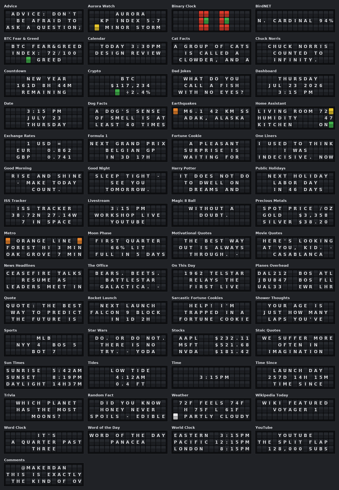

# Screenshots

Rendered views of every app, generated straight from the app code with sample data —
the Matrix-panel (LED) surface at the four common panel resolutions, and the split-flap
surface as a 3×15 wall mockup (see [the last section](#split-flap-wall-3--15)).

| Folder | Resolution |
| --- | --- |
| [r256x64/](r256x64/) | 256 × 64 |
| [r128x64/](r128x64/) | 128 × 64 |
| [r128x32/](r128x32/) | 128 × 32 |
| [r64x32/](r64x32/) | 64 × 32 |

Images are saved at 4× so the LED pixels stay crisp. Contact-sheet tiles are labeled with
each app's display name; the individual files are named by app id (so `entity-board.png`
is the **Home Assistant** app). Channels (quotes, jokes, facts …)
render generically on the panel — big text plus a themed icon — and are shown with one
representative line each.

The physical panel quantizes color (typically 3 bitplanes), so very dim tones look
slightly smoother in these PNGs than on real LEDs.

## All apps at a glance

### 256 × 64

### 128 × 64

### 128 × 32

### 64 × 32

## Split-flap wall (3 × 15)

Every app with a split-flap surface, mocked up on a 3-row × 15-column wall of flap
modules — the first page each app shows, with sample data. Colored tiles are the wall's
seven color flaps (emoji render as solid color modules). Animation apps are omitted —
a static frame of a motion effect says nothing. Individual images are in
[flap-3x15/](flap-3x15/).

