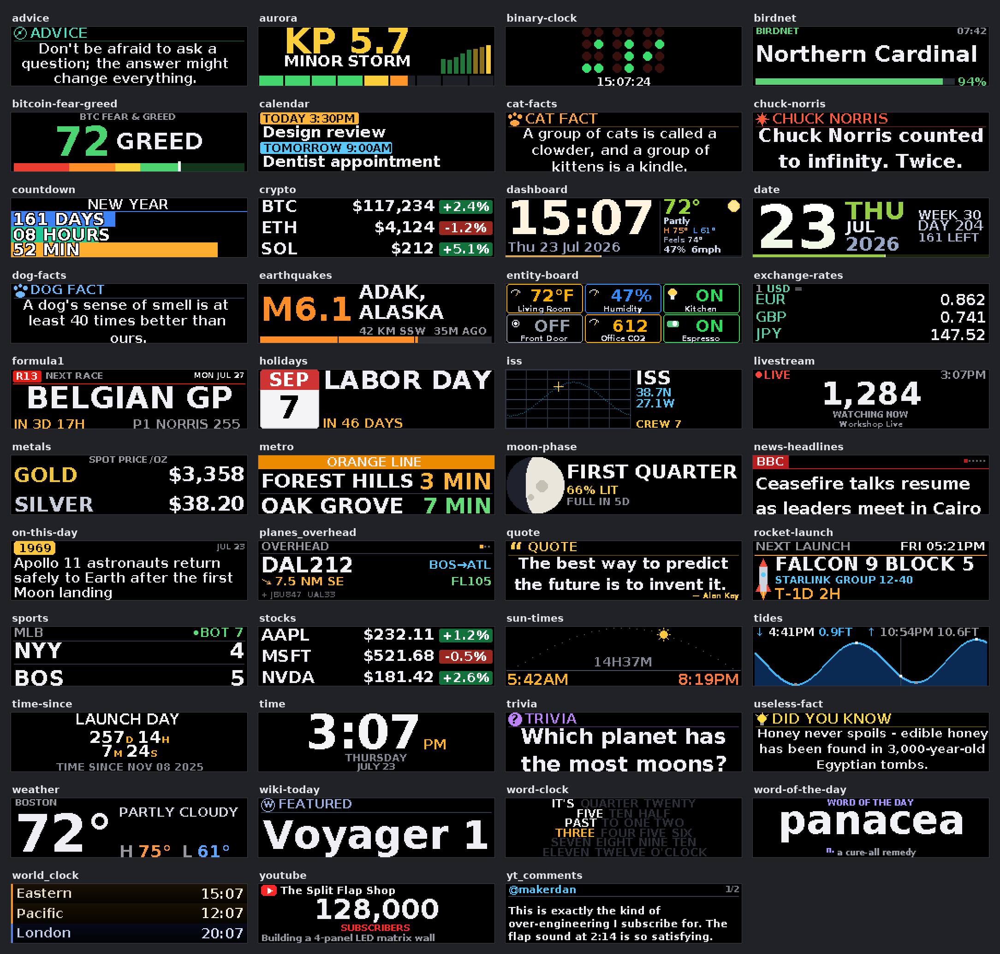
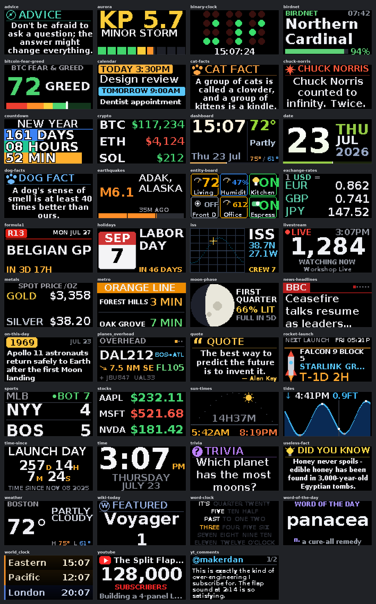
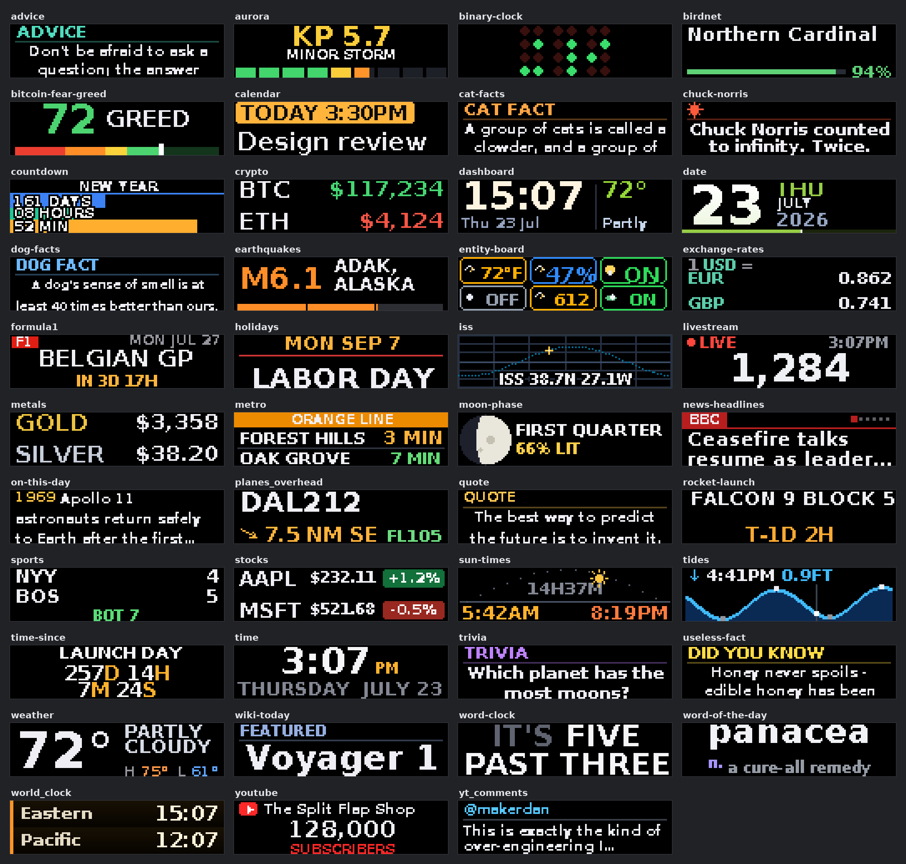
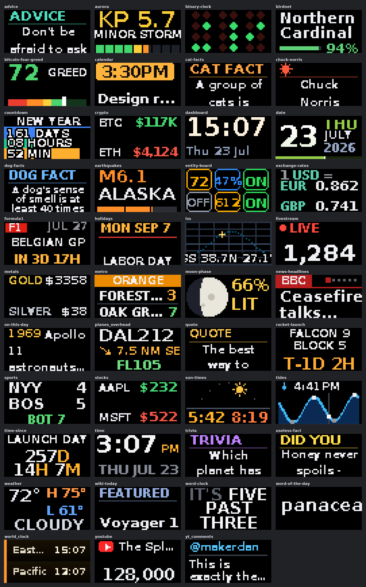

# Matrix panel screenshots

Rendered views of every app's Matrix-panel (LED) surface, generated straight from the
app code with sample data — what each app looks like on a Matrix Gateway wall. Every
app is rendered at the four common panel resolutions:

| Folder | Resolution |
| --- | --- |
| [r256x64/](r256x64/) | 256 × 64 |
| [r128x64/](r128x64/) | 128 × 64 |
| [r128x32/](r128x32/) | 128 × 32 |
| [r64x32/](r64x32/) | 64 × 32 |

Images are saved at 4× so the LED pixels stay crisp. Channels (quotes, jokes, facts …)
render generically on the panel — big text plus a themed icon — and are not included here.

The physical panel quantizes color (typically 3 bitplanes), so very dim tones look
slightly smoother in these PNGs than on real LEDs.

## All apps at a glance

### 256 × 64

### 128 × 64

### 128 × 32

### 64 × 32

